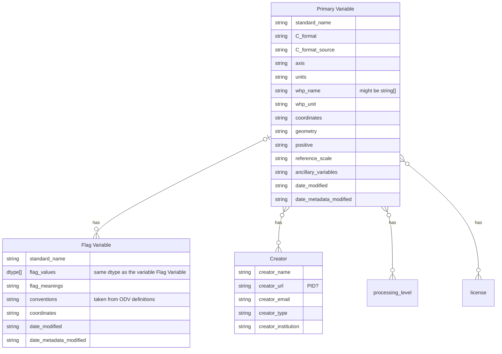

# CCHDO Metadata Model

```mermaid
erDiagram
    "Primary Variable" {
        string standard_name
        string C_format
        string C_format_source
        string axis
        string units
        string whp_name "might be string[]"
        string whp_unit
        string coordinates
        string geometry
        string positive
        string reference_scale
        string ancillary_variables
        string date_modified
        string date_metadata_modified
    }
    "Flag Variable" {
        string standard_name
        dtype[] flag_values "same dtype as the variable Flag Variable"
        string flag_meanings
        string conventions "taken from ODV definitions"
        string coordinates
        string date_modified
        string date_metadata_modified
    }
    Creator {
        string creator_name
        string creator_url "PID?"
        string creator_email
        string creator_type
        string creator_institution
    }

    processing_level
    license

    "Primary Variable" |o--o{ "Flag Variable" : has
    "Primary Variable" }o--o{ "Creator" : has
    "Primary Variable" }o--o{ "processing_level" : has
    "Primary Variable" }o--o{ "license" : has
```